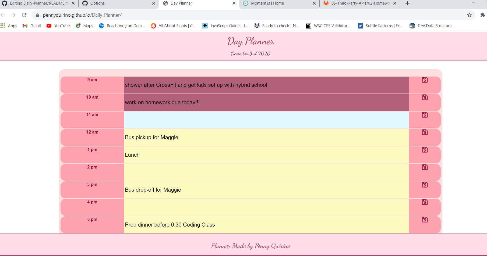

# Daily-Planner

<a href="https://pennyquirino.github.io/Daily-Planner/">Click to see my work</a> 

Create a simple calendar application that allows a user to save events for each hour of the day by modifying starter code. This app will run in the browser and feature dynamically updated HTML and CSS powered by jQuery.
This planner will help you plan your day accordingly.

  
  The past hours are represented with a darker pink/red, present hour is a light blue, and upcoming hours in the day are a light golden yellow. 
  

  
  The app will remind you to save with a shadow pulse over the save button. Once you save, it will always show when you pull up the calendar. 

